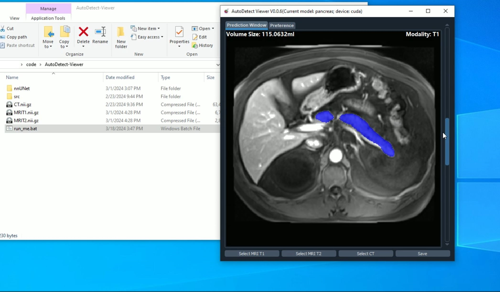

# Guidance for software setups

## Install

We provide one intuitive GUI software for running the segmentation with "all-in-one" format. All environments are included in the install package, thus the install package is silightly large (around 6.7Gb). This software will aslo calculate the pancreas volume after segmentation automatically for clinical purpose.

<ol>
    <li> Download the zip file from this [link](https://drive.google.com/file/d/16FKx51bXxC5BoLXbWjgQmRAbWEqyCXE0/view?usp=sharing).
    <li> Unzip it to a local folder.
    <li> Double-click the **run_me.bat** file to start.
    <li> Select input volumes from local folders and Wait for the software to segment the pancreas.
<ol>

## Example Video

A demo video is also provided [here](https://drive.google.com/file/d/1eyaZOvwBl0mQ8uVL9cA6dV1V4R7_UO95/view?usp=sharing).

